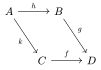

# The `yade` Package
<div align="center">Version 0.0.1</div>

Include diagrams made with the [yade](https://amblafont.github.io/graph-editor-web/index.html) diagram editor in your Typst documents.

## Usage

NOTE: This package is not yet on the Universe. Install it locally to use it.

NOTE: This package depends on `fletcher` v0.6.0, available on the `dev` branch of `fletcher`'s Github repository. Make `fletcher` to be accessible under `@local/fletcher:0.6.0` in order to use `yade`.

Import `yade` with

```typ
#import "@local/yade:0.0.1" as yade
```

This exposes 3 functions:
- `yade.diagram`
- `yade.yade`
- `yade.nodes_and_edges`

There are three ways of importing a yade diagram in your document.

### Via an external file 

Save your diagram in a file `path/to/my/diagram.yade`

Import it with 

```typ
#yade.diagram(path("path/to/my/diagram.yade"))
```

### Directly in your document 

#### One diagram at a time

Copy the yade diagram and paste it in a raw environment. Apply the `diagram` function on it.

```typ
#yade.diagram(```
{"graph":{"activeTabId":0,"latexBackgroundColor":"white","latexPreamble":"\\newcommand{\\coqproof}[1]{\\checkmark}","nextTabId":1,"tabs":[{"edges":[{"from":0,"id":4,"label":{"label":"h","options":{},"zindex":0},"to":1},{"from":2,"id":5,"label":{"label":"f","options":{},"zindex":0},"to":3},{"from":0,"id":6,"label":{"label":"k","options":{"alignment":"right"},"zindex":0},"to":2},{"from":1,"id":7,"label":{"label":"g","options":{},"zindex":0},"to":3}],"freehandDrawings":[],"id":0,"nextGraphId":8,"nodes":[{"id":0,"label":{"label":"A","options":{},"pos":[533,117],"zindex":0}},{"id":1,"label":{"label":"B","options":{},"pos":[611,117],"zindex":0}},{"id":2,"label":{"label":"C","options":{},"pos":[585,195],"zindex":0}},{"id":3,"label":{"label":"D","options":{},"pos":[663,195],"zindex":0}}],"sizeGrid":26,"title":"1"}]},"version":20}
```)
```

#### With a show rule

Use the `yade` function in a show rule to make all raw environments tagged with language `yade` into diagrams.

````typ
#show yade.yade

```yade
{"graph":{"activeTabId":0,"latexBackgroundColor":"white","latexPreamble":"\\newcommand{\\coqproof}[1]{\\checkmark}","nextTabId":1,"tabs":[{"edges":[{"from":0,"id":4,"label":{"label":"h","options":{},"zindex":0},"to":1},{"from":2,"id":5,"label":{"label":"f","options":{},"zindex":0},"to":3},{"from":0,"id":6,"label":{"label":"k","options":{"alignment":"right"},"zindex":0},"to":2},{"from":1,"id":7,"label":{"label":"g","options":{},"zindex":0},"to":3}],"freehandDrawings":[],"id":0,"nextGraphId":8,"nodes":[{"id":0,"label":{"label":"A","options":{},"pos":[533,117],"zindex":0}},{"id":1,"label":{"label":"B","options":{},"pos":[611,117],"zindex":0}},{"id":2,"label":{"label":"C","options":{},"pos":[585,195],"zindex":0}},{"id":3,"label":{"label":"D","options":{},"pos":[663,195],"zindex":0}}],"sizeGrid":26,"title":"1"}]},"version":20}
``` 
````

### With `fletcher`

Use the `nodes_and_edges` function to get the lists of `fletcher` nodes and edges. You can then insert them into a `fletcher` canvas and use fletcher to customize your diagram. Each node/edge is referencable with it's id number `<id>`.

```typ
#import "@local/fletcher:0.6.0" as fletcher

#let NnE = nodes_and_edges(```yade
{"graph":{"activeTabId":0,"latexBackgroundColor":"white","latexPreamble":"\\newcommand{\\coqproof}[1]{\\checkmark}","nextTabId":1,"tabs":[{"edges":[{"from":0,"id":4,"label":{"label":"h","options":{},"zindex":0},"to":1},{"from":2,"id":5,"label":{"label":"f","options":{},"zindex":0},"to":3},{"from":0,"id":6,"label":{"label":"k","options":{"alignment":"right"},"zindex":0},"to":2},{"from":1,"id":7,"label":{"label":"g","options":{},"zindex":0},"to":3}],"freehandDrawings":[],"id":0,"nextGraphId":8,"nodes":[{"id":0,"label":{"label":"A","options":{},"pos":[533,117],"zindex":0}},{"id":1,"label":{"label":"B","options":{},"pos":[611,117],"zindex":0}},{"id":2,"label":{"label":"C","options":{},"pos":[585,195],"zindex":0}},{"id":3,"label":{"label":"D","options":{},"pos":[663,195],"zindex":0}}],"sizeGrid":26,"title":"1"}]},"version":20}
```)

#fletcher.diagram(..NnE)
```

<div align="center">
<picture>
  
</picture>
</div>

## Options

The three functions have the following options allowing to customize the appearance of your diagrams
- `text_font` the font for text nodes (default `"New Computer Modern"`) [`yade`, `diagram`, `nodes_and_edges`]
- `size` text size (default `auto`) [`yade`]
- `scale` a scaling level applied to the structure of the diagram (not to the text). Can be a number or `none` to disable the default scaling (default `1`) [`yade`, `diagram`, `nodes_and_edges`]
- `debug` the level of debug you want to display. See `flecther`'s debug option (default `false`) [`yade`, `diagram`]
- `dictionary` a dictionary of pairs `key: content`. Labels of nodes and edges of the form `typ:key` are interpreted as `content` [`yade`, `diagram`, `nodes_and_edges`]

## Dependancy

This package depends on
- `fletcher` v0.6.0
- `cetz` v0.4.2 (via `fletcher`)
- `mitex` v0.2.6

## Known issues

- some bend arrows do not snap
- pullback arrows scale
